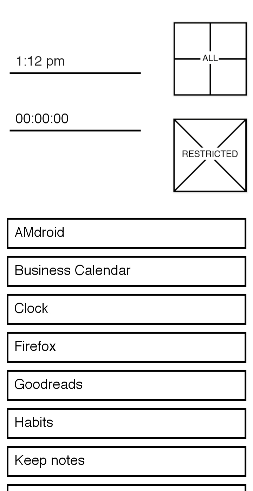
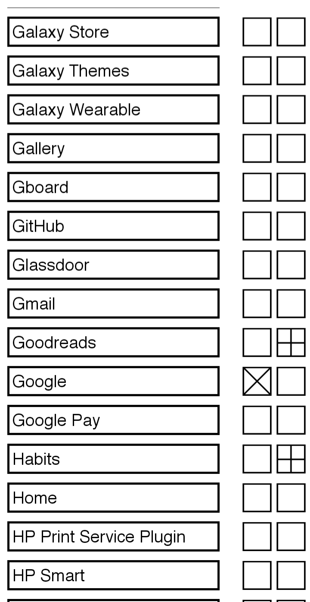

# MinimalLauncher

This Application is an Android launcher that meants to reduce your phone usage through different methods such as: 
- Allowing the user the set certain application as restricted 
- the restricted applications are then placed in a restricted section and can only be launched by going to the restricted section 
- each time the user opens a restricted app the process of launching the restricted app is delayed 
- the wait time is reset after 2 hours of not using restricted applications

# How to use 

1. allow background usage for the application 
2. allow usage data acess for the application 
3. go to the all application page and select the application you want in the restricted section or in the home page 
    - the right square in that page adds the application to your home page
    - the left squere adds the application to the restricted section 

# Images
Home Page
 

 
All Application Page
 

 
